# Исходный код диаграмм ZT-NMS

## 1. Дорожная карта тестирования (Mermaid Gantt)

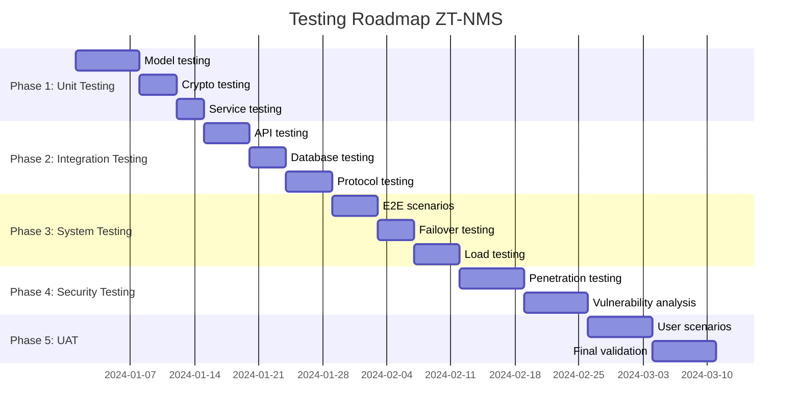

## 2. Архитектура системы (Mermaid Flowchart)

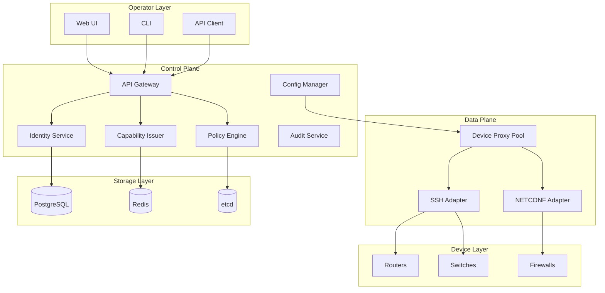

## 3. Поток аутентификации (Mermaid Sequence)

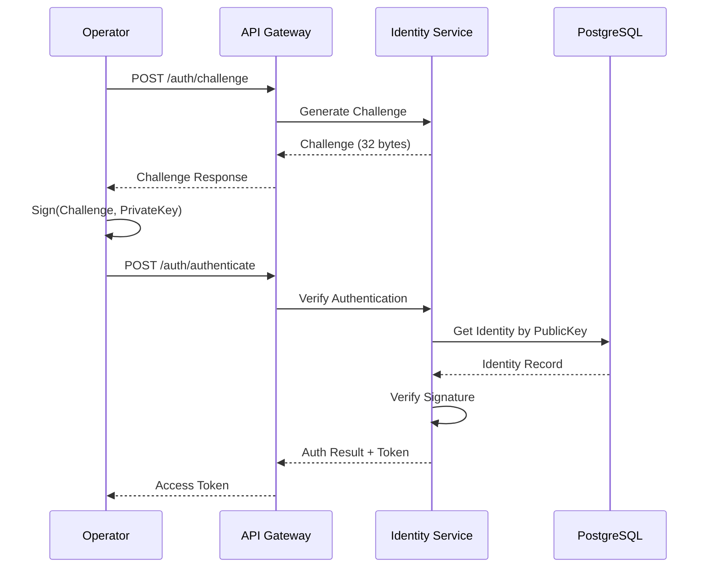

## 4. 4-фазный протокол (Mermaid State)

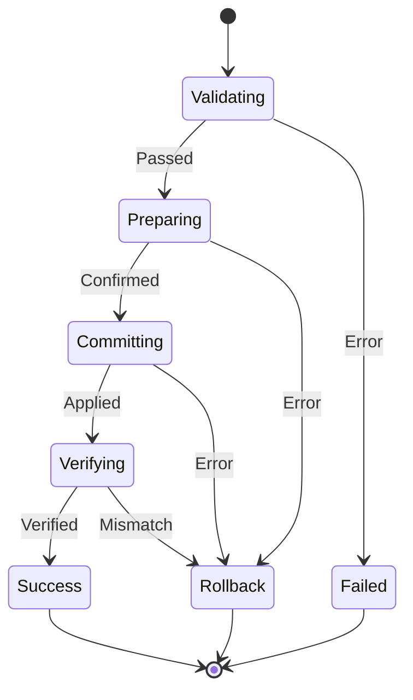

## 5. Сравнение архитектур (PlantUML)

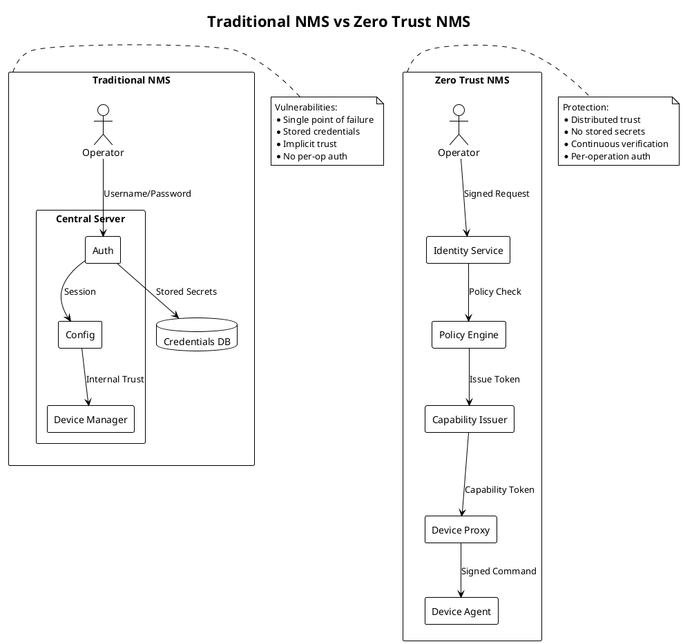

## 6. Поток Capability Token (PlantUML)

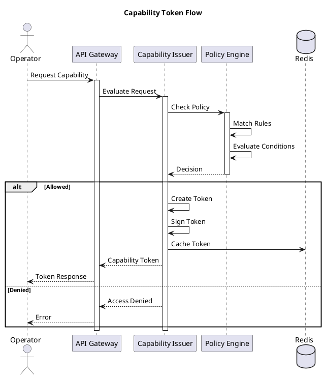

## 7. Диаграмма развертывания (PlantUML)

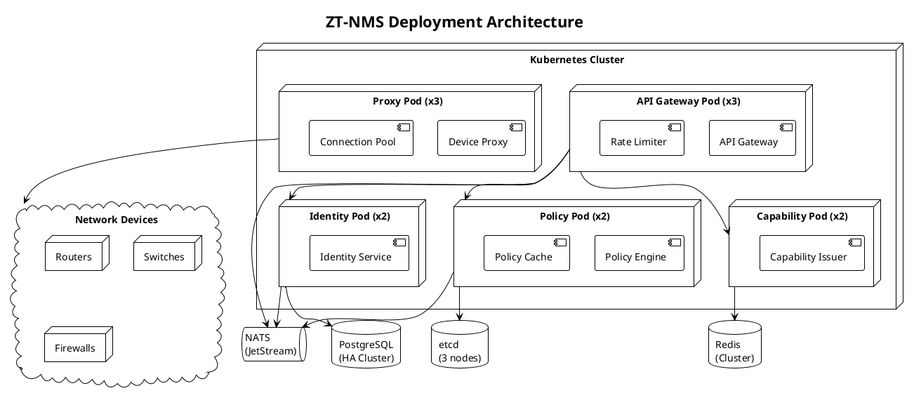

## 8. Диаграмма классов моделей (PlantUML)

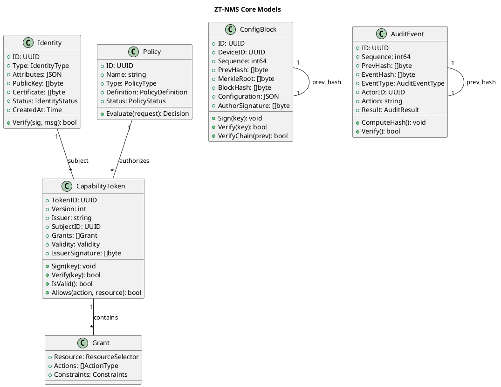

## 9. Диаграмма тестового покрытия (Mermaid Pie)

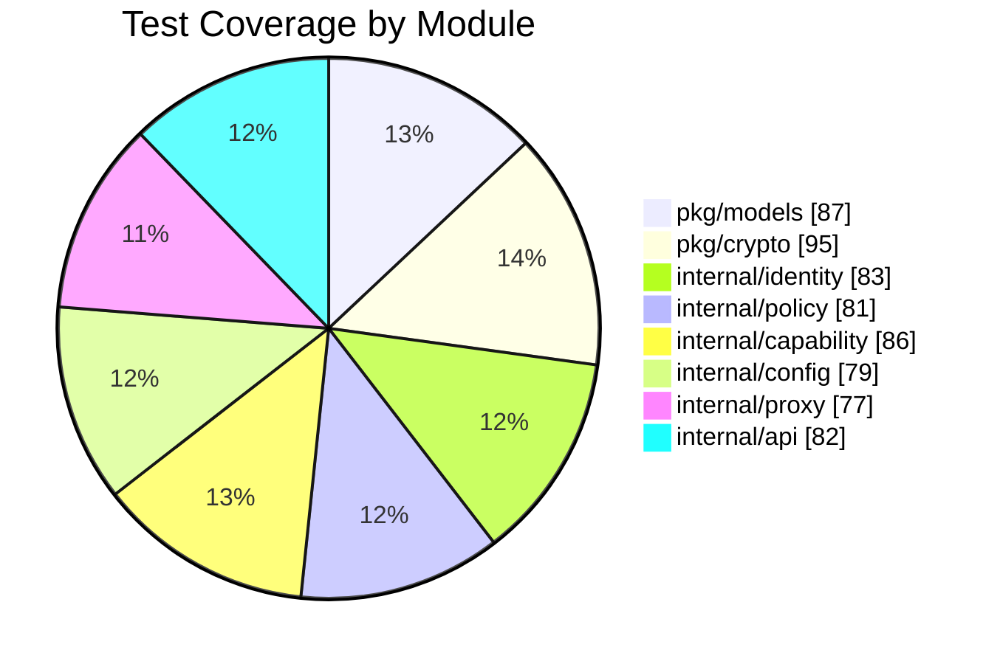

## 10. Диаграмма метрик производительности (Mermaid)

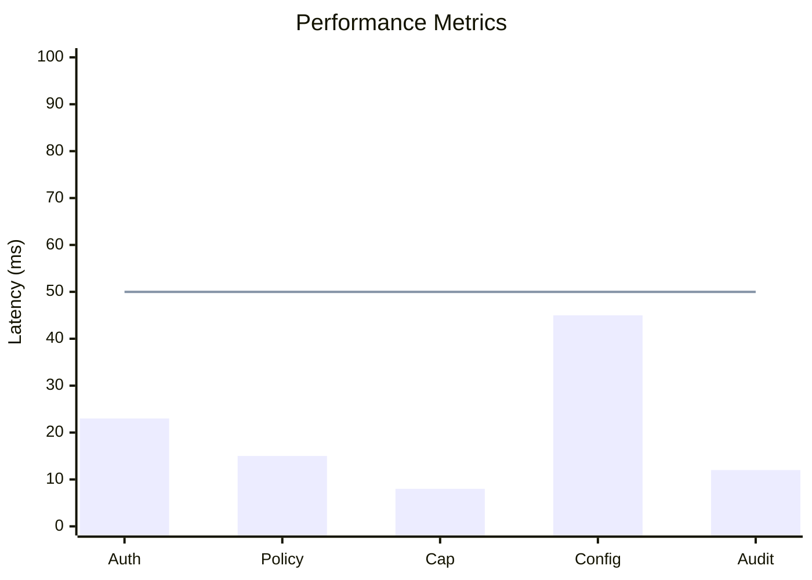

## 11. Сетевая топология тестового стенда (PlantUML)

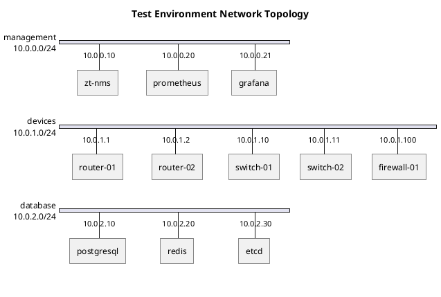

## 12. Матрица тестирования (ASCII)

```
+------------------+--------+--------+--------+--------+--------+
|                  | Unit   | Integ  | System | Secur  | Perf   |
+------------------+--------+--------+--------+--------+--------+
| Identity Service | 25     | 5      | 3      | 5      | 2      |
| Policy Engine    | 18     | 4      | 2      | 4      | 3      |
| Capability Issuer| 22     | 4      | 3      | 6      | 2      |
| Config Manager   | 16     | 5      | 4      | 3      | 2      |
| Device Proxy     | 14     | 4      | 3      | 2      | 3      |
| API Handlers     | 28     | 6      | 5      | 5      | 4      |
| Crypto Module    | 20     | 2      | 1      | 8      | 2      |
| Models           | 88     | -      | -      | -      | -      |
+------------------+--------+--------+--------+--------+--------+
| TOTAL            | 231    | 30     | 21     | 33     | 18     |
+------------------+--------+--------+--------+--------+--------+
```
